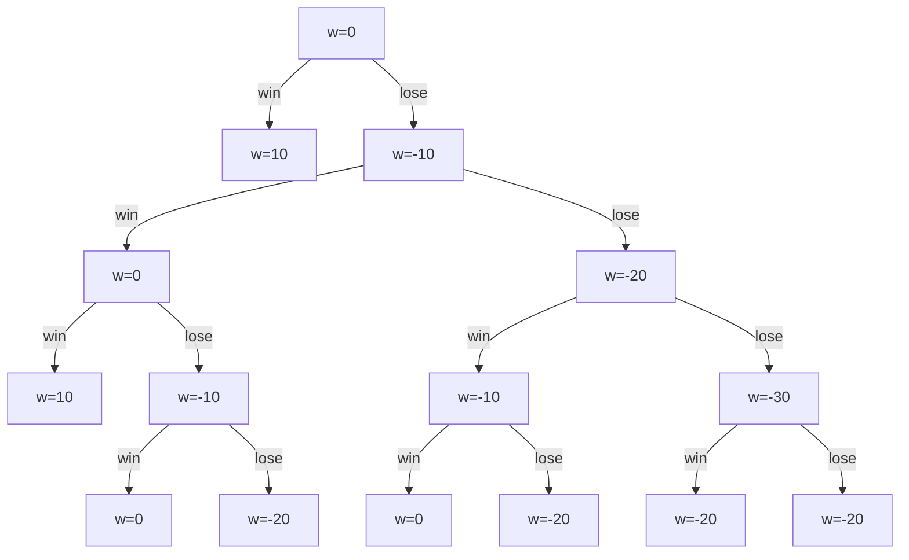

# Problem Set 6

## 1. EU Theory

Prove
$$
\overline{X}=\int xdF_L(x)\geq c(F_L,u) \quad\text{where $c(F_L,u)$ is certainty equivilence }
$$
**Jensens' inequality**

If $u(\cdot)$ is concave:
$$
u(\int xdF_L(x))\geq\int u(x)dF_L(x)
$$
**Certainty equivalence**
$$
u(c(F_L,u))=\int u(x)dF_L(x)
$$
Take **Jensens' inequality** and **certainty equivalence** together
$$
u(c(F_L,u))=\int u(x)dF_L(x)\leq u(\int xdF_L(x))
$$
$u(\cdot)$ is strictly increasing 
$$
u(c(F_L,u))\leq u(\int xdF_L(x)) \iff c(F_L,u)\leq\int xdF_L(x) 
$$

## 2. State-Space Model

|            | probabilities | $\pi_1$ | $\pi_2$  |
| :--------: | :-----------: | :-----: | :------: |
| quantities |  asset/state  | state 1 | state 2  |
|   $x_1$    |    asset 1    |   $1$   |   $1$    |
|   $x_2$    |    asset 2    |   $0$   | $U[1,2]$ |

Utility functions in two states
$$
\begin{cases}
u_1(z)=\log(z) \\
u_2(z)=2\log(z)
\end{cases}
$$

$$
\begin{align}
\max_{x_1,x_2}\quad & \pi_1u_1(x_1\times1+x_2\times0)+\pi_2\int_1^2 u_2(x_1\times1+x_2\times r)dF(r) \\
\text{s.t.}\quad &
\begin{cases}
x_1+x_2\leq w \\
x_1\geq0 \\
x_2\geq0
\end{cases}
\end{align}
$$

$$
\text{$u(\cdot)$ is strictly increasing in $x_1, x_2\implies$Walras' law holds $\implies x_1=w-x_2$ }
$$

$$
\begin{align}
\min_{x_1,x_2}\quad & -\pi_1\log(w-x_2)-(1-\pi_1)\int_1^22\log(w-x_2+rx_2)dr+\mu_1(x_2-w)+\mu_2(-x_2) \\
\textrm{s.t.}\quad &
\begin{cases}
\mu_1,\mu_2\geq0 \\
\mu_1(x_2-w)=0, \mu_2(-x_2)=0 \quad\text{complementary slackness}
\end{cases}
\end{align}
$$

Leibniz-rule
$$
\frac{d}{dx}\int_a^bu(x,t)dt=\int_a^b\frac{d}{dx}u(x,t)dt
$$

$$
L(x_2)=-\pi_1\log(w-x_2)-(1-\pi_1)\int_1^22\log(w-x_2+rx_2)dr+\mu_1(x_2-w)+\mu_2(-x_2)
$$

FOC:
$$
\frac{\partial L}{\partial x_2}=\frac{\pi_1}{w-x_2}-(1-\pi_1)\int_1^2\frac{2(r-1)}{w-x_2+rx_2}dr+\mu_1-\mu_2=0
$$

$$
\begin{cases}
\mu_1,\mu_2\geq0 \\
\mu_1(x_2-w)=0, \mu_2(-x_2)=0 \quad\text{complementary slackness}
\end{cases}
$$

$$
\begin{gather}
\text{$u(\cdot)$ is concave and constraint set is convex} \\
\Downarrow \\
\text{Convex optimization} \\
\Downarrow \\
\text{Solution is unique and KKT conditions are sufficient}
\end{gather}
$$

Assume $x_2=0$
$$
\mu_1(x_2-w)=-\mu_1w=0\implies\mu_1=0
$$
FOC:
$$
\frac{\pi_1}{w}-(1-\pi_1)\int_1^2\frac{2(r-1)}{w}dr-\mu_2=0\implies
\frac{\pi_1}{w}=\frac{1-\pi_1}{w}+\mu_2
$$

$$
\begin{align}
\frac{1-\pi_1}{w}+\mu_2&\geq\frac{1-\pi_1}{w} \\
\frac{\pi_1}{w}&\geq\frac{1-\pi_1}{w} \\
\pi_1&\geq\frac{1}{2}
\end{align}
$$

## 3. Prospect Theory

$$
u(x)=
\begin{cases}
\sqrt{x}, & x\geq0 \\
-\sqrt{-x}, & x<0
\end{cases}
$$

### 3(a)

* DM is risk-averse in gain domain and risk-seeking in loss domain (satisfied)
* DM is loss-averse (not satisfied)
* Probability weighting (not satisfied)

It is consistent with Prospect Theory

### 3(b)

$$
w=0
$$

$$
L=
\begin{cases}
10 & \text{with probability }\frac{1}{2} \\
-10 & \text{with probability }\frac{1}{2}
\end{cases}
$$

$$
\begin{cases}
u(w)=u(0)=\sqrt{0}=0 \\
u(w+L)=\frac{1}{2}u(10)+\frac{1}{2}u(-10)=\frac{1}{2}\sqrt{10}+\frac{1}{2}(-\sqrt{10})=0
\end{cases}
$$

$$
u(w)=u(w+L)
$$

The DM is indifferent about accepting the gamble if $w=0$ 

### 3(c)

To show
$$
\text{if } w\in(-10,0)\implies u(w)<u(w+L)\quad\text{DM accepts L}
$$

$$
u(w)=-\sqrt{-w}
$$

$$
u(w+L)=\frac{1}{2}\sqrt{w+10}+\frac{1}{2}\left(-\sqrt{-(10-w)}\right)=
\frac{1}{2}(\sqrt{w+10}-\sqrt{10-w})
$$

Prove $-\sqrt{-w}<\frac{1}{2}(\sqrt{w+10}-\sqrt{10-w})$ always holds if $w\in(-10,0)$ 
$$
\begin{align}
\underbrace{-\sqrt{-w}}_\text{negative}&<\underbrace{\frac{1}{2}(\sqrt{w+10}-\sqrt{10-w})}_\text{negative} \\
-w&>\frac{1}{4}(w+10+10-w-2\sqrt{100-w^2}) \\
-4w&>20-2\sqrt{100-w^2} \\
-2w&>10-\sqrt{100-w^2} \\
\sqrt{100-w^2}&>10+2w
\end{align}
$$
We need to show $\sqrt{100-w^2}>10+2w$ holds when $w\in(-10,0)$ 

* $w\in(-10,-5)$ 
  $$
  \underbrace{\sqrt{100-w^2}}_\text{non-negative}>\underbrace{10+2w}_\text{negative} 
  \quad\text{always holds}
  $$

* $w\in[-5, 0)$ 
  $$
  \begin{align}
  \sqrt{100-w^2}&>10+2w \\
  100-w^2&>100+40w+4w^2 \\
  0&>40w+5w^2 \\
  0&>8w+w^2 \\
  0&>w(8+w) \\
  \end{align}
  \text{always true when }w\in[-5,0)
  $$

### 3(d)

$$
\begin{cases}
\text{accept} & w\in(-\infty,-10) \\
\text{accept} & w\in(-10,0) \\
\text{accept} & w=0 \\
\text{reject} & w\in(0,10) \\
\text{reject} & w\in(10,+\infty) \\
\end{cases}
\implies
\begin{cases}
\text{accept} & w\leq 0 \\
\text{reject} & w>0
\end{cases}
$$

|   wealth    |       10        |       0        |      -20       |      -40       |
| :---------: | :-------------: | :------------: | :------------: | :------------: |
| probability | $\frac{10}{16}$ | $\frac{2}{16}$ | $\frac{3}{16}$ | $\frac{1}{16}$ |

$$
L=
\begin{cases}
10 & \frac{5}{8} \\
0 & \frac{1}{8} \\
-20 & \frac{3}{16} \\
-40 & \frac{1}{16}
\end{cases}
$$

$$
\begin{align}
E(L)&=10\times\frac{5}{8}+0\times\frac{1}{8}-20\times\frac{3}{16}-40\times\frac{1}{16} \\
&=\frac{25}{4}-\frac{15}{4}-\frac{5}{2} \\
&=0
\end{align}
$$

### 3(e)

$$
U(0)=0
$$

$$
\begin{align}
U(L)&=\frac{5}{8}\sqrt{10}+\frac{1}{8}\sqrt{0}+\frac{3}{16}\times(-\sqrt{20})+\frac{1}{16}\times(-\sqrt{40}) \\
&\approx 0.74>0
\end{align}
$$

DM (strictly) prefers to accept  this gamble.

## Rabin's Critique

Assume CARA (Constant Absolute Risk Aversion) $u(x)=-e^{-\sigma x}$
$$
\begin{cases}
u(w+L)=\frac{1}{2}(-e^{-\sigma(w+11)}-e^{-\sigma(w-10)}) \\
u(w)=-e^{-\sigma w}
\end{cases}
$$

$$
\begin{align}
u(w)&\geq u(w+L) \\
-e^{-\sigma w}&\geq \frac{1}{2}(-e^{-\sigma(w+11)}-e^{-\sigma(w-10)}) \\
2e^{-\sigma w}&\leq e^{-\sigma(w+11)}+e^{-\sigma(w-10)} \\
2&\leq e^{-11\sigma}+e^{10\sigma} \\
\sigma&\geq 0.009
\end{align}
$$

$$
\begin{cases}
u(w+L')=\frac{1}{2}(-e^{-\sigma(w+Y)}-e^{-\sigma(w-100)}) \\
u(w)=-e^{-\sigma w}
\end{cases}
$$

$$
\begin{align}
u(w)&\geq u(w+L') \\
-e^{-\sigma w}&\geq\frac{1}{2}(-e^{-\sigma(w+Y)}-e^{-\sigma(w-100)}) \\
2e^{-\sigma w}&\leq e^{-\sigma(w+Y)}+e^{-\sigma(w-100)} \\
2&\leq e^{-\sigma Y}+e^{100\sigma} \quad\text{always holds}
\end{align}
$$

No matter how high $Y$ is, DM always rejects $L'$ 

